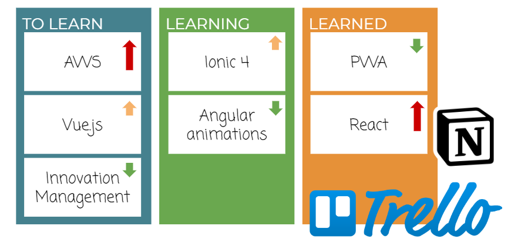

## 🤩 Dicas pra ficar antenado

### 1. Construa uma base sólida

Aprenda:
- Lógica de programação
- Uma linguagem de programação
- Princípios de algoritmos
- Orientação a objetos

Essa base vai te sustentar ao longo da sua carreira, mas não se esqueça de que ela também precisa de reparos. Ou seja, mesmo quando já estiver trabalhando e com anos de experiência, revisite esses tópicos eventualmente.

### 2. Busque fontes confiáveis

Filtre suas fontes
- há conteúdo demais e nem todos agregam
- procure indicações e newsletters

### 3. Escolha o que estudar

A escolha de uma tecnologia depende da necessidade e do conhecimento do desenvolvedor.

#### 3.1. Avalie as techs

Alguns pontos a serem analisados quando você vai escolher algo para estudar:
- Quem está usando?
- Como é o github/documentação dessa tech?
- A comunidade é ativa?
- Qual é a curva de aprendizado?
- Novas versões frequentes?

#### 3.2. Crie uma lista de prioridades

- Use uma ferramenta qualquer para criar listas de items para estudo. Sugestão: trello ou notion
- Essa lista deve ser priorizada de acordo com a importância e urgência daquilo que você precisa estudar
- Essa lista é muito dinâmica e pode ser modificada com constância
    - inclua prioridade em cada item e mude de acordo com a necessidade
    - inclua ou remova items sempre que achar necessário
    - mantenha ATUALIZADO!

### 4. Reserve tempo

#### 4.1. Pra estudar

- Use técnicas que funcionem para você
- O importante é a consistência
- Não se sobrecarregue!

Sugestão de canal no YT com dicas de estudo muito boas: [Thomas Frank](youtube.com/c/Thomasfrank)

#### 4.2. Pra praticar
- Prática é o que realmente dá XP
- Consistência
- Crie um portfólio de práticas

Crie um portfolio de práticas no GitHub e no [Codepen](https://codepen.io)

### 5. Compartilhe e participe

Ensinar ainda é a melhor forma de aprender!
- escreva artigos
- crie projetos abertos
- participe de open source
- meetups
- etc

### 6. Busque ajuda e crie sua rede

#### 6.1. Networking
- Criar relacionamentos com outros profissionais da área

#### 6.2. Mentoria
- Profissionais mais experientes podem te ajudar com dicas e experiências que já viveram

### Dicas bônus

#### Siga seu ritmo

- Paciência é fundamental
- Não há atalhos fáceis, experiência demanda tempo
- Não adianta sair estudando tudo o que aparece, senioridade demanda mais do que só a parte técnica
- _Você pode chegar mais rápido, mas não cortar o caminho_

#### Entenda seu perfil

- Entenda seus pontos fortes e fracos e o que te motiva
- Aceitar passar por "pontos baixos"
- Saiba procurar ajuda
- Encontre seu estilo de aprendizagem
- Procure feedbacks constantes
- Experiências de vida (maturidade) também contribuem muito
- Busque ter um plano de desenvolvimento da sua carreira (independente do emprego atual)
- _No fim do dia, o que importa não é apenas o salário e o cargo e sim ter propósito e gostar do que faz_

---

### Mais referências:
- [7 Learning Habits for Developers: Reach Skill Goals in Less Time](sitepoint.com/learning-habits-for-developers/)
    
    TLDR: As a developer, it’s important to always be learning. The industry is constantly changing, and if you don’t keep up, you’ll quickly fall behind. 75% of respondents learn a new technology at least every few months or once a year.

- [How to Learn Anything: A Beginner’s Guide to Ultralearning](https://www.sitepoint.com/how-to-learn-anything/)

    TLDR:
    Ultralearning is a learning approach developed by Scott Young that offers helpful guidelines on how to structure learning projects outside of formal education. In this article, we’ll provide you with 3 research-based learning strategies that are key to every learning endeavor. We’ve also introduced you to the Ultralearing Framework.

---

[🏠 Voltar para o início](./../../README.md)